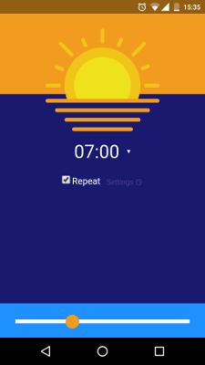

# YaWL - Yet another Wake-Up Light

I've always wanted a wake-up light, but the existing ones are either too expensive or setting the time with physical buttons is annoying. The first light I've built was based on an Arduino and a Bluetooth module. However, updating native apps as mobile operating systems evolve is a pain. Thankfully, there is the ESP8266, that has WiFi and can host a small mobile app.

Features:

- A web app that looks kind of native if placed on the start screen
- Setting the time you wish to wake up
- Setting the period it takes to get from zero to full brightness
- Setting a timeout to switch the light off after the alarm time
- Repeated mode: wake up at the same time every day without changing settings
- Slider to directly set the brightness for use during the day 

Planned:

- Store parameters to EEPROM and get current time from the internet, so the settings survive a restart
- Capacitive sensing: adjust brightness by touching the lamp
- WiFi-Management: easy entering of WiFi credentials

### Hardware

- An ESP8266 module
- A source of light that is dimmable via PWM (I use a 10W LED + driver from China)

### Software

Basically an Arduino sketch, that serves a single page app. Sketch and app communicate via Websockets. 

Dependencies:

- [ESPAsyncWebServer](https://github.com/me-no-dev/ESPAsyncWebServer)
- [arduinoWebSockets](https://github.com/Links2004/arduinoWebSockets)
- [ArduinoJson](https://github.com/bblanchon/ArduinoJson)
- [Time](https://github.com/PaulStoffregen/Time)
- [TimeAlarms](https://github.com/PaulStoffregen/TimeAlarms)
- [CapacitiveSensor](https://github.com/PaulStoffregen/CapacitiveSensor)
- [ProcessScheduler](https://github.com/wizard97/ArduinoProcessScheduler)

----
### Credits

- Thanks to user 'Madebyoliver' (http://www.flaticon.com/authors/madebyoliver) from flaticon.com for the sun icon, licensed by "Creative Commons BY 3.0"
- Thanks to [Lucas](https://github.com/pistolenernie) and Ahmad for their feedback on the user interface

### License
WTFPL